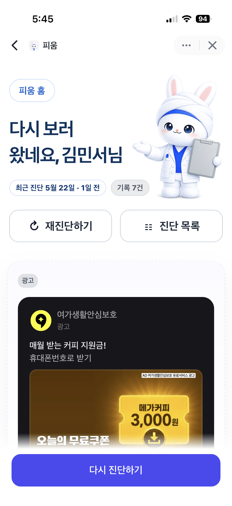
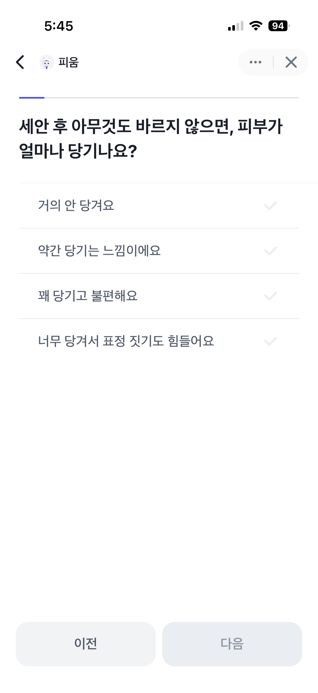
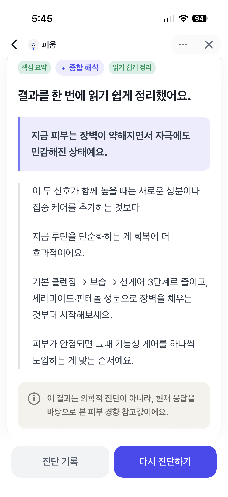

## 피움 Pium · Backend API
> 토스 미니앱(앱인토스)으로 실운영 중인 피부타입 분석 서비스의 백엔드입니다.
> 
> 팀 프로젝트를 혼자 재설계하였고, 해당 레포지토리는 전적으로 제 작업물만 담고 있습니다
> 
> 원본 팀 프로젝트 레포지토리 -> [skin-service](https://github.com/swyp-3team/skin-service.git)
---
## Live Service

- 서비스 링크: [피움 바로가기](https://minion.toss.im/zge4f54D)
- 참고: 모바일 환경에서 열어야 정상적으로 확인 가능합니다.
- 실행 환경: Toss 앱인토스 미니앱
- 백엔드 배포: DigitalOcean, Docker, Nginx, HTTPS

> 현재 클라이언트는 Toss 앱인토스 WebView로 제공하고 있지만,  
> 백엔드는 클라이언트 종류에 의존하지 않는 REST API로 구성해 웹 클라이언트 확장도 고려했습니다.

<p align="center">
  
  
  
</p>

---
## Core Feature
### 규칙 기반 피부 상태 분석 
피움의 피부 분석은 AI API에 의존하지 않고,  
설문 응답을 도메인 규칙으로 해석해 피부 상태를 계산합니다.
```text
Survey Answer
  사용자가 제출한 설문 응답

-> Normalize
  내부 분석 엔진이 읽을 수 있는 표준 입력으로 정규화

-> Question Rule Matching
  문항 ID와 선택지 코드를 기준으로 점수 규칙 매칭

-> Metric Score Calculation
  건조·유분·트러블·민감·톤·탄력 6개 직접 지표 계산

-> Barrier Score Derivation
  건조/민감 신호를 기반으로 장벽 지표 파생

-> SkinAnalysisResult
  7축 피부 상태 결과 저장

-> State Labeling
  점수를 LOW / MID / HIGH 상태 라벨로 변환

-> Result Text Composition
  상태 조합에 따른 한줄 요약과 상세 해석 생성
```

관련 구현:

- [SurveySubmissionNormalizerAdapter](src/main/java/com/pium/adapter/outbound/skinanalysis/normalizer/SurveySubmissionNormalizerAdapter.java): 설문 응답 정규화
- [QuestionRule](src/main/java/com/pium/domain/skinanalysis/engine/QuestionRule.java): 문항/선택지별 점수 규칙
- [DefaultSkinAnalysisEngine](src/main/java/com/pium/domain/skinanalysis/engine/DefaultSkinAnalysisEngine.java): 분석 엔진 파사드
- [SkinMetricScoreCalculator](src/main/java/com/pium/domain/skinanalysis/engine/SkinMetricScoreCalculator.java): 직접 지표 계산
- [BarrierScoreDeriver](src/main/java/com/pium/domain/skinanalysis/engine/BarrierScoreDeriver.java): 장벽 점수 파생
- [SkinAnalysisResultViewComposer](src/main/java/com/pium/application/skinanalysis/result/service/SkinAnalysisResultViewComposer.java): 결과 라벨링 및 해석 문장 생성

### 사진 기반 보조 진단
사진 진단은 원본 이미지를 저장하지 않고, 짧은 TTL의 분석 세션을 통해 이미지 신호와 보조 문항을 결합합니다.
사진 분석이 진행 중이면 프론트는 `retryAfterSeconds` 이후 같은 요청을 재시도하고, 완료되면 기존 `SkinAnalysisResult` 결과 화면을 그대로 재사용합니다.
```text
Image Upload
-> Pre Analyze
  원본 이미지는 저장하지 않고 임시 분석 세션 생성

-> Assistant Questions
  이미지 신호만으로 부족한 지점을 보조 문항으로 확인

-> Image Signal + Answers
  사진 신호와 사용자의 보조 응답을 융합

-> SkinAnalysisResult
  설문 진단과 동일한 7축 결과 모델로 저장
```

관련 구현:

- [SkinImageAnalysisController](src/main/java/com/pium/adapter/inbound/web/skinanalysis/image/SkinImageAnalysisController.java): 사진 분석 API
- [SkinImageAnalysisPolicy](docs/SkinImageAnalysisPolicy.md): 사진 분석 정책과 API 흐름

### 피부 상태 기반 상품 추천
추천은 최신 피부 진단 결과와 사용자의 goal을 해석해 상품 검색 조건을 만들고,
상품 원본 데이터에서 생성한 `ProductProfile`과 비교해 안전성을 우선한 추천 결과를 생성합니다.
추천 화면에는 내부 trait/risk 용어를 노출하지 않고, 사용자 언어의 케어 태그와 사용 전 참고점으로 제공합니다.
```text
SkinAnalysisResult
-> SkinInterpretation
  피부 상태와 goal을 추천 의도로 해석

-> ProductSearchSpec
  필요한 케어 포인트와 피해야 할 부담 신호 정리

-> ProductProfile Candidate
  상품 원본 데이터를 추천용 의미 모델로 변환한 후보 조회

-> RecommendationPolicy
  안전성 게이트, 패널티, 점수 상한선 적용

-> Recommendation List / Detail
  추천 목록, 추천 상세 근거, 광고 고지 제공
```

관련 구현:

- [GetProductRecommendationService](src/main/java/com/pium/application/recommendation/service/GetProductRecommendationService.java): 최신 진단 기반 추천 목록/상세 조회
- [ProductRecommendationTextComposer](src/main/java/com/pium/application/recommendation/service/ProductRecommendationTextComposer.java): 추천 이유, 케어 태그, 주의 문구 생성
- [RecommendationPolicy](src/main/java/com/pium/domain/recommendation/engine/scoring/RecommendationPolicy.java): 추천 점수와 안전성 정책
- [RecommendationUxContract](docs/recommendation/RecommendationUxContract.md): 프론트 추천 화면 계약

### Provider 기반 OAuth 로그인
프론트는 각 provider에서 받은 authorization code를 백엔드로 전달하고,
백엔드는 provider별 외부 OAuth 통신을 처리한 뒤 서비스 자체 JWT를 발급합니다.
현재 Toss, Google, Kakao 로그인을 지원하며 Google은 admin/web 콜백 구분을 위해 `clientType`을 사용합니다.

---

## Production
현재 백엔드는 DigitalOcean 서버에서 Docker기반으로 운영 중이며,  
토스 앱인토스 WebView 클라이언트와 HTTPS 통신으로 연동되어 있습니다.

### 배포 파이프라인 
배포 파이프라인은 GitHub Actions에서 CI 성공 후 GHCR 이미지를 빌드하고,  
서버에서 신규 앱 컨테이너를 반대 슬롯에 띄운 뒤 health check가 통과하면  
Nginx upstream을 새포트로 전환하는 방식으로 구성했습니다.  
```text
GitHub Actions CI
-> bootJar / test
-> Docker image build & push to GHCR
-> SSH deploy
-> app-blue / app-green 슬롯 전환 
-> /actuator/health 확인 
-> Nginx upstream reload
```
---

## Architecture
이 프로젝트는 **Adapter** - **Application** - **Domain** 계층을 기준으로 구성했습니다.  
```text
adapter
  ├─ inbound   // Web API, request/response mapping
  └─ outbound  // Persistence, OAuth provider API, OpenAI, JWT

application
  ├─ auth
  ├─ user
  ├─ skinanalysis
  └─ recommendation

domain
  ├─ user
  ├─ skinanalysis
  ├─ product
  ├─ productprofile
  └─ recommendation
```
---

## Domain Design

피움의 핵심 흐름은 설문 응답을 피부 상태 벡터로 변환하고,  
이후 추천 도메인이 해당 상태를 소비할 수 있도록 표준화하는 것입니다.  
```text
설문 응답
-> 정규화된 응답 모델
-> SkinMetricScore
-> SkinAnalysisResult
-> 상태 라벨 및 해석 문장
-> SkinInterpretation
-> ProductSearchSpec
-> ProductProfile 후보 비교
-> 추천 결과
```
---

## Problems & Decisions
### 1. 설문 점수를 그대로 피부 상태로 말할 수 없었다

설문 점수는 물리 단위가 아니기 때문에 `70점`이 `10점`보다 정확히 7배 심각하다고 말할 수 없습니다.  
그래서 점수는 내부 계산 신호로만 사용하고, 사용자에게는 `LOW / MID / HIGH` 상태 라벨과 근거 문장으로 전달했습니다.

### 2. 장벽 상태는 사용자가 직접 인식하기 어렵다

피부 장벽은 직접 문항으로 묻기보다 건조, 민감, 자극 반응 패턴에서 파생하는 신호로 설계했습니다.  
이 `BARRIER` 값은 이후 추천 단계에서 안전 게이트로 사용할 수 있도록 분리했습니다.

### 3. 추천 기능을 분석 로직과 분리했다

상품 추천은 분석 점수를 직접 읽어 상품을 고르는 방식으로 만들지 않았습니다.  
먼저 `SkinAnalysisResult`를 `SkinInterpretation`으로 해석하고,  
그 결과를 `ProductSearchSpec`으로 번역한 뒤 상품의 `ProductProfile`과 비교합니다.

이렇게 분리해 설문 진단과 사진 진단이 같은 결과 모델을 공유하고,  
추천 도메인은 입력 경로가 아니라 피부 상태와 goal만 바라보도록 설계했습니다.

### 4. Toss 로그인 특수성을 인증 도메인 밖으로 격리했다

Toss 로그인은 authorizationCode, referrer, mTLS 등 플랫폼 특성이 있지만,  
서비스 내부에서는 provider 기반 외부 사용자 식별 결과만 다루도록 분리했습니다.  
로그인 성공 후 프론트에는 외부 provider 토큰이 아닌 자체 JWT만 반환합니다.

Google/Kakao 로그인도 같은 provider 기반 흐름에 맞췄고,  
Google은 admin/web 리다이렉트 URI를 `clientType`으로 구분합니다.

### 5. 탈퇴 회원은 인증 경계에서 차단한다

회원 탈퇴는 사용자를 삭제하지 않고 상태를 변경하는 방식으로 처리합니다.  
JWT로 사용자를 로드할 때 ACTIVE 상태만 인증 사용자로 인정하고,  
기존 OAuth 매핑이 남아 있더라도 탈퇴 상태의 사용자는 로그인 흐름에서 차단합니다.
---

## Documents

| 문서 | 내용 |
| --- | --- |
| [Domain Overview](docs/domain/domain-overview.md) | 전체 도메인 분리 기준 |
| [SkinAnalysis Domain](docs/domain/SkinAnalysisDomain.md) | 피부 분석 도메인 책임과 경계 |
| [Product Domain](docs/domain/ProductDomain.md) | 상품/성분 도메인 설계 |
| [Recommendation Domain](docs/domain/RecommendationDomain.md) | 추천 도메인 확장 방향 |
| [SkinAnalysis 해석 모델](docs/SkinAnalysisEvidenceModelProposal.md) | 점수를 상태로 해석한 이유 |
| [추천 설계 개요](docs/Skin-Recommendation-Overview.md) | 안전성 우선 추천 설계 |
| [Recommendation Flow](docs/recommendation/RecommendationFlow.md) | 진단 결과부터 상품 추천까지 전체 흐름 |
| [Skin Interpretation](docs/recommendation/SkinInterpretation.md) | 피부 상태와 goal을 ProductSearchSpec으로 번역하는 중간 해석 모델 |
| [Safety Policy](docs/recommendation/SafetyPolicy.md) | 추천 safety gate와 조합별 hard/soft/caution 기준 |
| [Product Profiling](docs/recommendation/ProductProfiling.md) | 상품 원본 데이터를 ProductProfile로 변환하는 ACL 설계 |
| [Recommendation UX Contract](docs/recommendation/RecommendationUxContract.md) | 추천 목록/상세 화면 응답과 사용자 노출 문구 기준 |
| [Frontend Recommendation Prompt](docs/recommendation/FrontendRecommendationPrompt.md) | 프론트 추천 화면 구현 참고 계약 |
| [Skin Image Analysis Policy](docs/SkinImageAnalysisPolicy.md) | 사진 기반 보조 진단 정책과 API 흐름 |
| [Login Policy](docs/Login-policy.md) | Toss 로그인 및 JWT 정책 |
| [Survey](docs/survey.md) | 설문 구성 원칙 |
| [설문 문항집](docs/설문_문항집.md) | 실제 설문 문항과 metric 매핑 |
