## 피움 Pium · Backend API
> 토스 미니앱(앱인토스)으로 실운영 중인 피부타입 분석 서비스의 백엔드입니다.
> 
> 팀 프로젝트를 혼자 재설계하였고, 해당 레포지토리는 전적으로 제 작업물만 담고 있습니다
> 
> 원본 팀 프로젝트 레포지토리 -> [skin-service](https://github.com/swyp-3team/skin-service.git)
---
## Live Service

- 서비스 링크:
  - [피움 앱인토스 바로가기](https://minion.toss.im/zge4f54D)
  - [피움 웹 바로가기](https://pium.app)
- 참고: 모바일 환경에서 열어야 정상적으로 확인 가능합니다.
- 실행 환경: Toss 앱인토스 미니앱
- 백엔드 배포: DigitalOcean, Docker, Nginx, HTTPS

> 현재 Toss 앱인토스와 웹 서비스로 운영 중이며,
> 백엔드는 클라이언트 종류에 의존하지 않는 REST API로 구성했습니다.

---
## Why

피부 상태는 하나의 피부 타입으로 설명하기 어렵습니다.
건조함과 유분, 트러블과 민감처럼 여러 신호가 동시에 나타날 수 있으며, 설문 점수의 작은 차이를 정밀한 피부 상태 차이로 해석하는 것도 적절하지 않습니다.

또한 특정 고민만 보고 기능이 강한 제품을 추천하면 현재 피부 장벽이나 민감 상태에 부담을 줄 수 있습니다.
피움은 피부를 7개 상태축의 조합으로 해석하고, 사용자의 목표보다 현재 피부가 감당할 수 있는 조건을 우선하여 상품을 추천합니다.

핵심 목표는 단순히 효능이 맞는 상품을 찾는 것이 아니라,
**추천 이유와 주의점을 설명할 수 있는 안전한 후보를 제공하는 것**입니다.

---
## Product Overview

### Toss Mini App
<p align="center">
  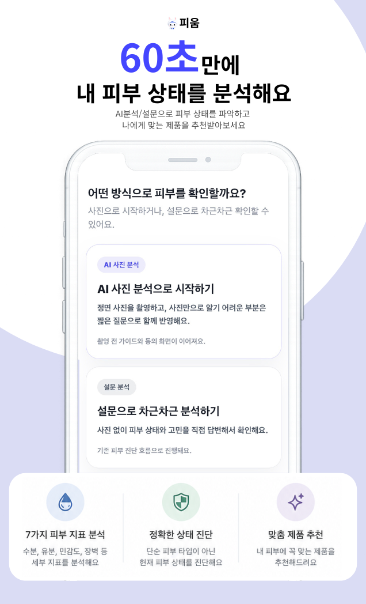
  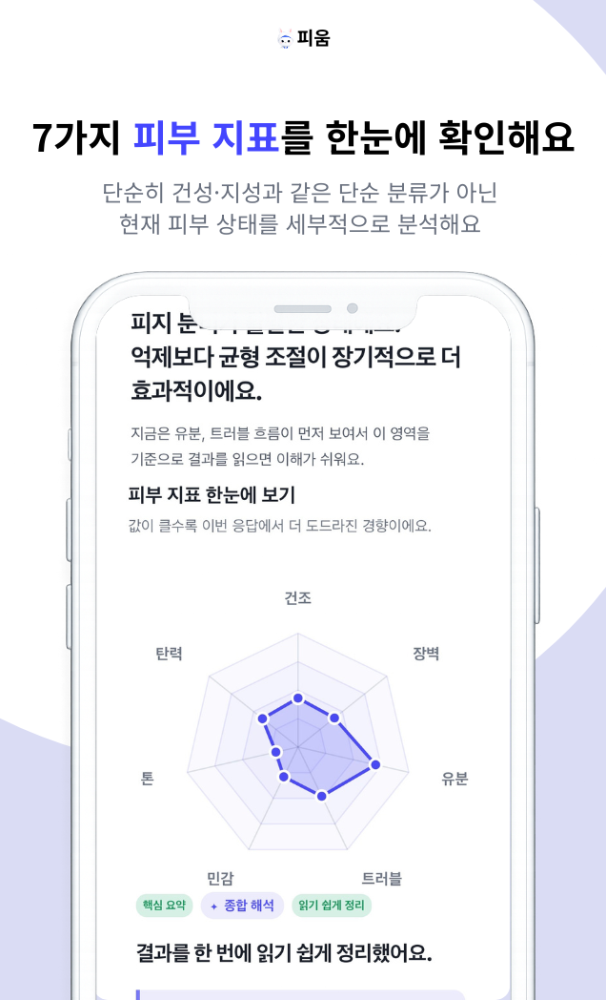
  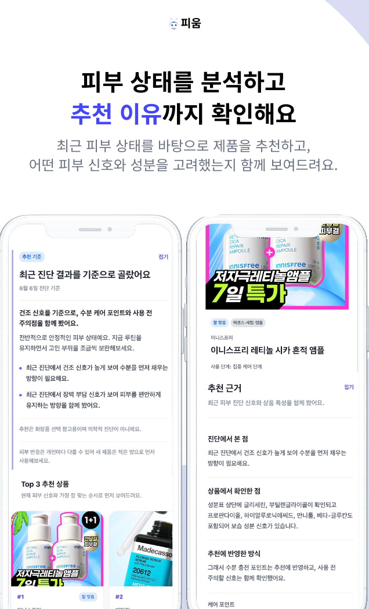
</p>

### Web
<table>
  <tr>
    <td align="center">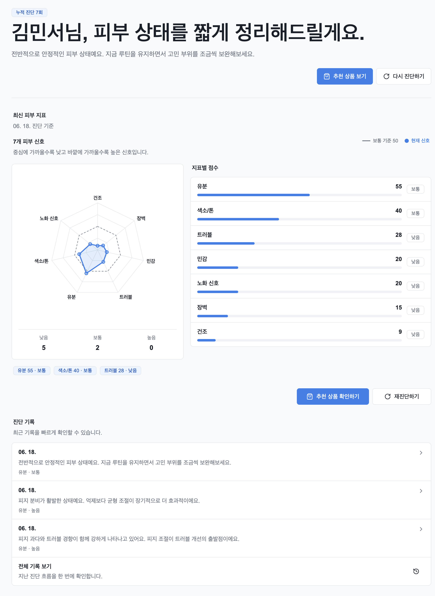</td>
    <td align="center">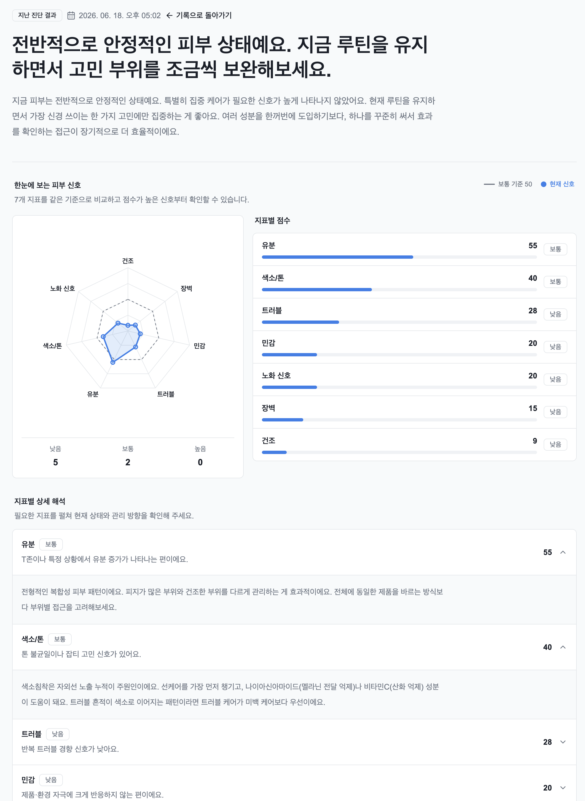</td>
    <td align="center">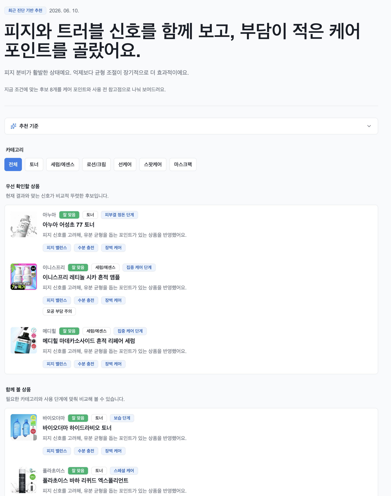</td>
    <td align="center">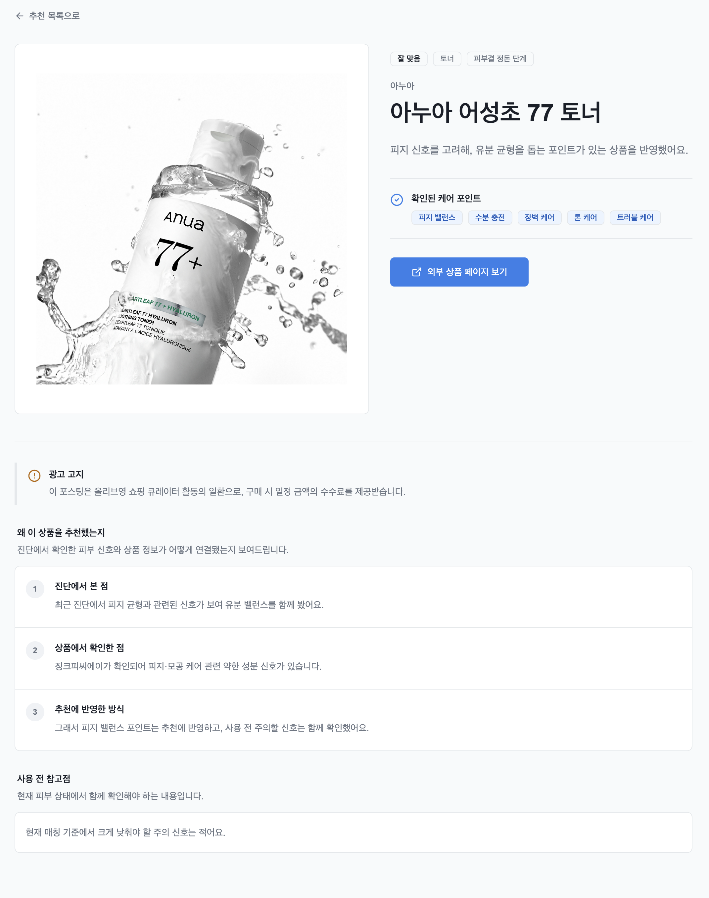</td>
  </tr>
  <tr>
    <td align="center">홈</td>
    <td align="center">피부 진단 결과</td>
    <td align="center">추천 상품</td>
    <td align="center">추천 상품 상세</td>
  </tr>
</table>

### Admin
<table>
  <tr>
    <td align="center">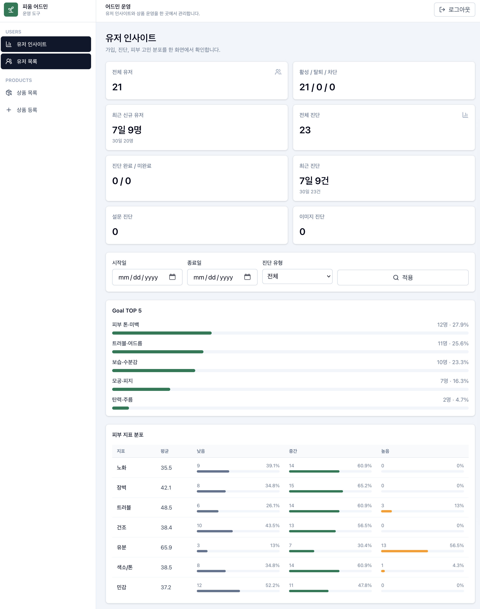</td>
    <td align="center">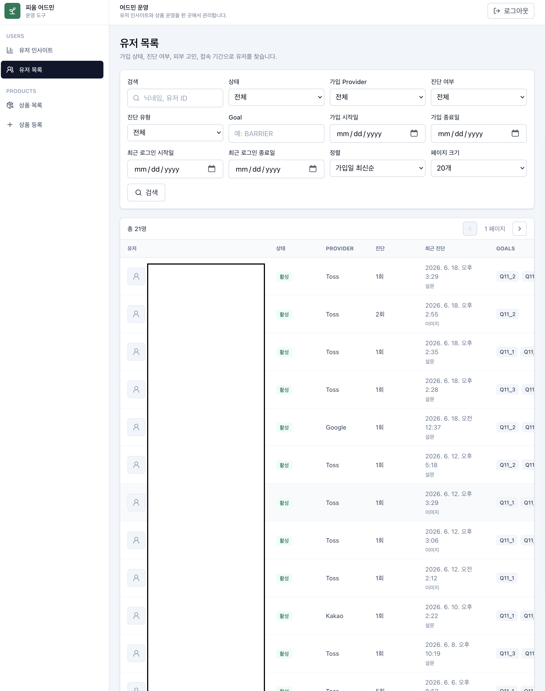</td>
    <td align="center">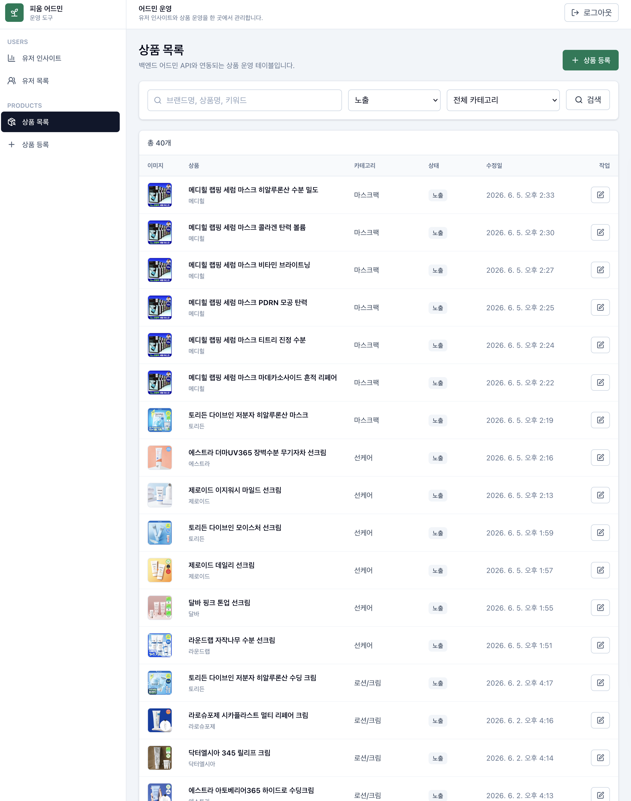</td>
    <td align="center">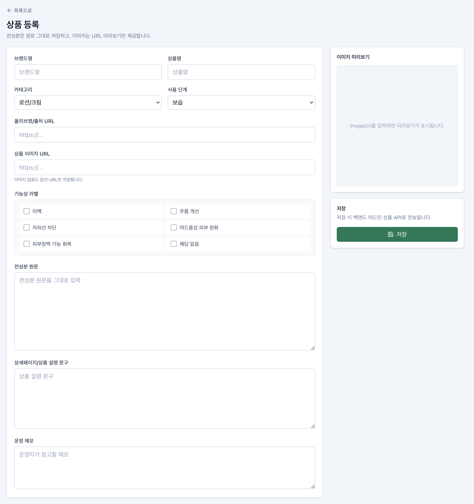</td>
  </tr>
  <tr>
    <td align="center">유저 인사이트</td>
    <td align="center">유저 목록</td>
    <td align="center">상품 목록</td>
    <td align="center">상품 등록</td>
  </tr>
</table>

---
## Core Features
### 규칙 기반 피부 상태 분석 
피움의 피부 분석은 AI API에 의존하지 않고,  
설문 응답을 도메인 규칙으로 해석해 피부 상태를 계산합니다.
```text
Survey Answer
  사용자가 제출한 설문 응답

-> Normalize
  내부 분석 엔진이 읽을 수 있는 표준 입력으로 정규화

-> Question Rule Matching
  문항 ID와 선택지 코드를 기준으로 점수 규칙 매칭

-> Metric Score Calculation
  건조·유분·트러블·민감·톤·탄력 6개 직접 지표 계산

-> Barrier Score Derivation
  건조/민감 신호를 기반으로 장벽 지표 파생

-> SkinAnalysisResult
  7축 피부 상태 결과 저장

-> State Labeling
  점수를 LOW / MID / HIGH 상태 라벨로 변환

-> Result Text Composition
  상태 조합에 따른 한줄 요약과 상세 해석 생성
```

관련 구현:

- [SurveySubmissionNormalizerAdapter](src/main/java/com/pium/adapter/outbound/skinanalysis/normalizer/SurveySubmissionNormalizerAdapter.java): 설문 응답 정규화
- [QuestionRule](src/main/java/com/pium/domain/skinanalysis/engine/QuestionRule.java): 문항/선택지별 점수 규칙
- [DefaultSkinAnalysisEngine](src/main/java/com/pium/domain/skinanalysis/engine/DefaultSkinAnalysisEngine.java): 분석 엔진 파사드
- [SkinMetricScoreCalculator](src/main/java/com/pium/domain/skinanalysis/engine/SkinMetricScoreCalculator.java): 직접 지표 계산
- [BarrierScoreDeriver](src/main/java/com/pium/domain/skinanalysis/engine/BarrierScoreDeriver.java): 장벽 점수 파생
- [SkinAnalysisResultViewComposer](src/main/java/com/pium/application/skinanalysis/result/service/SkinAnalysisResultViewComposer.java): 결과 라벨링 및 해석 문장 생성

### 사진 기반 보조 진단
사진 진단은 원본 이미지를 저장하지 않고, 짧은 TTL의 분석 세션을 통해 이미지 신호와 보조 문항을 결합합니다.
사진 분석이 진행 중이면 프론트는 `retryAfterSeconds` 이후 같은 요청을 재시도하고, 완료되면 기존 `SkinAnalysisResult` 결과 화면을 그대로 재사용합니다.
```text
Image Upload
-> Pre Analyze
  원본 이미지는 저장하지 않고 임시 분석 세션 생성

-> Assistant Questions
  이미지 신호만으로 부족한 지점을 보조 문항으로 확인

-> Image Signal + Answers
  사진 신호와 사용자의 보조 응답을 융합

-> SkinAnalysisResult
  설문 진단과 동일한 7축 결과 모델로 저장
```

관련 구현:

- [SkinImageAnalysisController](src/main/java/com/pium/adapter/inbound/web/skinanalysis/image/SkinImageAnalysisController.java): 사진 분석 API
- [SkinImageAnalysisPolicy](docs/SkinImageAnalysisPolicy.md): 사진 분석 정책과 API 흐름

### 피부 상태 기반 상품 추천
추천은 최신 피부 진단 결과와 사용자의 goal을 해석해 상품 검색 조건을 만들고,
상품 원본 데이터에서 생성한 `ProductProfile`과 비교해 안전성을 우선한 추천 결과를 생성합니다.
추천 화면에는 내부 trait/risk 용어를 노출하지 않고, 사용자 언어의 케어 태그와 사용 전 참고점으로 제공합니다.
```text
SkinAnalysisResult
-> SkinInterpretation
  피부 상태와 goal을 추천 의도로 해석

-> ProductSearchSpec
  필요한 케어 포인트와 피해야 할 부담 신호 정리

-> ProductProfile Candidate
  상품 원본 데이터를 추천용 의미 모델로 변환한 후보 조회

-> RecommendationPolicy
  안전성 게이트, 패널티, 점수 상한선 적용

-> Recommendation List / Detail
  추천 목록, 추천 상세 근거, 광고 고지 제공
```

관련 구현:

- [GetProductRecommendationService](src/main/java/com/pium/application/recommendation/service/GetProductRecommendationService.java): 최신 진단 기반 추천 목록/상세 조회
- [ProductRecommendationTextComposer](src/main/java/com/pium/application/recommendation/service/ProductRecommendationTextComposer.java): 추천 이유, 케어 태그, 주의 문구 생성
- [RecommendationPolicy](src/main/java/com/pium/domain/recommendation/engine/scoring/RecommendationPolicy.java): 추천 점수와 안전성 정책
- [RecommendationUxContract](docs/recommendation/RecommendationUxContract.md): 프론트 추천 화면 계약

### Provider 기반 OAuth 로그인
프론트는 각 provider에서 받은 authorization code를 백엔드로 전달하고,
백엔드는 provider별 외부 OAuth 통신을 처리한 뒤 서비스 자체 JWT를 발급합니다.
현재 Toss, Google, Kakao 로그인을 지원하며 Google은 admin/web 콜백 구분을 위해 `clientType`을 사용합니다.

---

## System Design

### System Architecture

<p align="center">
  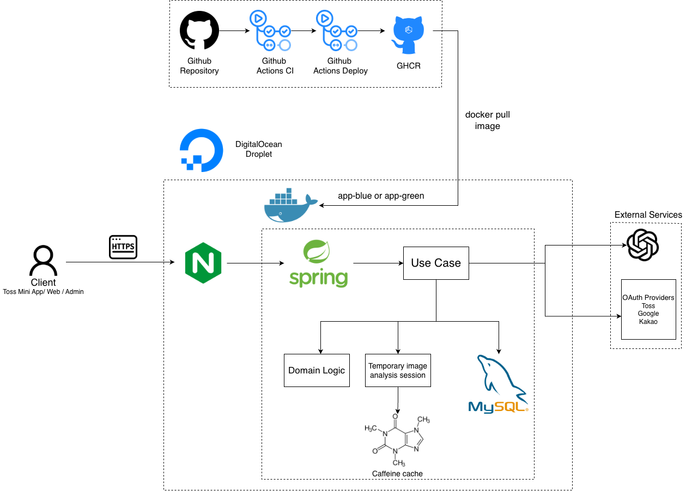
</p>

클라이언트 요청은 Nginx를 통해 Spring Boot 애플리케이션으로 전달되며, 영속 데이터는 MySQL에 저장합니다.
사진 분석은 비동기로 실행하고 Caffeine Cache에서 임시 세션으로 관리한 뒤 최종 진단 결과에 통합합니다.
OpenAI API와 OAuth Provider는 외부 어댑터를 통해 연동합니다.

### Backend Architecture

이 프로젝트는 **Adapter** - **Application** - **Domain** 계층을 기준으로 구성했습니다.  

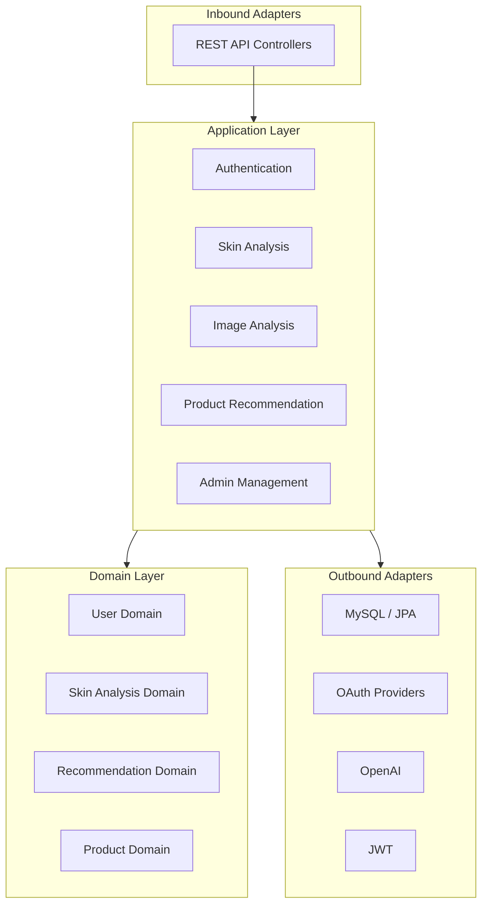

Inbound Adapter가 API 요청을 받아 Application의 Use Case를 실행하고, Application은 Domain의 분석·추천 정책을 조합합니다.
DB, OAuth, JWT, OpenAI 같은 외부 기술은 Outbound Adapter로 분리하여 핵심 도메인 로직이 특정 인프라 구현에 직접 의존하지 않도록 설계했습니다.

---

## Domain Design

피움의 핵심 흐름은 설문 응답을 피부 상태 벡터로 변환하고,  
이후 추천 도메인이 해당 상태를 소비할 수 있도록 표준화하는 것입니다.  
```text
설문 응답
-> 정규화된 응답 모델
-> SkinMetricScore
-> SkinAnalysisResult
-> 상태 라벨 및 해석 문장
-> SkinInterpretation
-> ProductSearchSpec
-> ProductProfile 후보 비교
-> 추천 결과
```
---

## Technical Challenges

### 설문 점수를 복합 피부 상태로 해석하기

설문 점수는 물리적 측정값이 아니므로 점수 차이를 피부 상태의 정확한 비율로 해석할 수 없습니다.
또한 건조와 유분처럼 서로 다른 신호가 동시에 나타나는 복합 상태를 하나의 피부 타입으로 설명하기 어렵습니다.

이를 해결하기 위해 피부 상태를 7개 지표로 분리하고 점수는 내부 계산에만 사용했습니다.
사용자에게는 `LOW / MID / HIGH` 상태와 지표 조합에 따른 해석을 제공합니다. 장벽 상태는 직접 문항으로 단정하지 않고 건조와 민감 신호를 기반으로 파생합니다.

### 진단 완료율 개선을 위한 AI 사진 분석

서비스 운영 과정에서 11개의 설문 문항이 진입 장벽으로 작용하여, 진단 결과를 확인하기 전에 이탈하는 사용자가 많다는 문제를 확인했습니다.

문항을 단순히 축소하는 대신 각 피부 지표의 측정 방식을 재검토했습니다.
이미지에서 비교적 관측하기 쉬운 트러블·색소·노화 지표는 AI 분석 결과를 중심으로 산출하고, 건조·유분·민감처럼 사진만으로 판단하기 어려운 지표는 보조 문항과 결합했습니다. 기존 설문 진단도 유지해 사용자가 진단 방식을 선택할 수 있도록 했습니다.

사진 분석은 비동기로 실행하여 분석 시간 동안 사용자가 보조 문항에 응답할 수 있도록 구성했습니다.
모델 선정 시 분석 품질뿐 아니라 응답 시간과 API 비용을 함께 검토하여 사용자 경험, 분석 신뢰도, 운영 비용 사이의 균형을 고려했습니다.

### AI 기반 상품 메타데이터 생성과 안전한 추천

상품의 전성분과 설명은 비정형 데이터이기 때문에 추천에 필요한 특성을 사람이 일일이 분류하면 운영 비용이 커집니다.
반대로 AI가 상품 추천까지 직접 수행하면 판단 근거와 일관성을 통제하기 어렵습니다.

AI는 상품을 추천하는 대신 상품 원본 데이터를 `ProductProfile` 메타데이터로 구조화하는 데 사용했습니다.
효능·주의 특성, 성분군, 근거와 신뢰도를 자동 생성하여 상품 등록 생산성을 높이고, 실제 추천은 서버의 안전성 게이트와 점수 정책이 담당하도록 역할을 분리했습니다.

---
## Infrastructure & Deployment

<p align="center">
  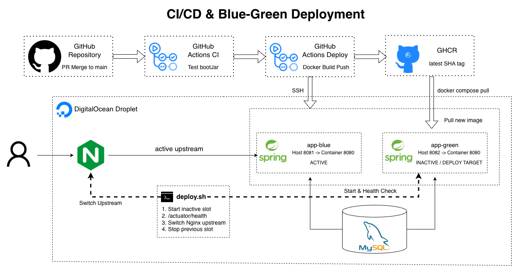
</p>

### CI/CD Pipeline

기능 브랜치를 `main`에 병합하면 GitHub Actions CI가 테스트와 `bootJar` 빌드를 수행합니다.
CI 성공 시 Deploy Workflow가 Docker 이미지를 빌드하여 GHCR에 SHA 및 `latest` 태그로 업로드합니다.

```text
Pull Request Merge
-> GitHub Actions CI
-> Test / bootJar
-> Docker Image Build
-> GHCR Push
-> SSH Deploy
```

### Blue-Green Deployment

GitHub Actions는 배포 설정과 스크립트를 SCP로 복사한 뒤 SSH를 통해 DigitalOcean 서버의 `deploy.sh`를 실행합니다.
서버는 GHCR에서 신규 이미지를 Pull하고, 현재 운영 중이지 않은 Blue/Green 슬롯에 새로운 컨테이너를 실행합니다.

| 슬롯 | 호스트 포트 | 컨테이너 포트 |
| --- | ---: | ---: |
| Blue | 8081 | 8080 |
| Green | 8082 | 8080 |

신규 슬롯의 `/actuator/health`가 정상 응답하면 Nginx upstream을 해당 슬롯으로 변경하고 기존 슬롯을 종료합니다.

### Deployment Failure Handling

신규 컨테이너의 Health Check가 실패하면 Nginx upstream을 변경하지 않습니다.
따라서 기존 컨테이너가 계속 요청을 처리하고 실패한 신규 배포의 로그를 확인할 수 있습니다.

> **정상 상태가 확인된 컨테이너만 운영 트래픽을 받도록 하여 배포 중단 위험을 줄였습니다.**

---
## Operating a Real Service

- 실제 사용자 흐름을 바탕으로 긴 설문으로 인한 이탈 문제를 확인하고 사진 진단 경로를 추가했습니다.
- 사용자 현황, 진단 기록, 피부 지표와 관심 고민 분포를 확인할 수 있는 관리자 조회 기능을 구축했습니다.
- 관리자가 상품 원본 정보와 `ProductProfile`을 등록·검수·재생성할 수 있도록 운영 기능을 분리했습니다.
- OpenAI와 OAuth 같은 외부 서비스 실패를 내부 오류와 구분하고, 사진 분석 실패 시 재촬영 또는 설문 진단으로 전환할 수 있도록 구성했습니다.

---

## Documents

| 문서 | 내용 |
| --- | --- |
| [Domain Overview](docs/domain/domain-overview.md) | 전체 도메인 분리 기준 |
| [SkinAnalysis Domain](docs/domain/SkinAnalysisDomain.md) | 피부 분석 도메인 책임과 경계 |
| [Product Domain](docs/domain/ProductDomain.md) | 상품/성분 도메인 설계 |
| [Recommendation Domain](docs/domain/RecommendationDomain.md) | 추천 도메인 확장 방향 |
| [SkinAnalysis 해석 모델](docs/SkinAnalysisEvidenceModelProposal.md) | 점수를 상태로 해석한 이유 |
| [추천 설계 개요](docs/Skin-Recommendation-Overview.md) | 안전성 우선 추천 설계 |
| [Recommendation Flow](docs/recommendation/RecommendationFlow.md) | 진단 결과부터 상품 추천까지 전체 흐름 |
| [Skin Interpretation](docs/recommendation/SkinInterpretation.md) | 피부 상태와 goal을 ProductSearchSpec으로 번역하는 중간 해석 모델 |
| [Safety Policy](docs/recommendation/SafetyPolicy.md) | 추천 safety gate와 조합별 hard/soft/caution 기준 |
| [Product Profiling](docs/recommendation/ProductProfiling.md) | 상품 원본 데이터를 ProductProfile로 변환하는 ACL 설계 |
| [Recommendation UX Contract](docs/recommendation/RecommendationUxContract.md) | 추천 목록/상세 화면 응답과 사용자 노출 문구 기준 |
| [Frontend Recommendation Prompt](docs/recommendation/FrontendRecommendationPrompt.md) | 프론트 추천 화면 구현 참고 계약 |
| [Skin Image Analysis Policy](docs/SkinImageAnalysisPolicy.md) | 사진 기반 보조 진단 정책과 API 흐름 |
| [Login Policy](docs/Login-policy.md) | Toss 로그인 및 JWT 정책 |
| [Survey](docs/survey.md) | 설문 구성 원칙 |
| [설문 문항집](docs/설문_문항집.md) | 실제 설문 문항과 metric 매핑 |
